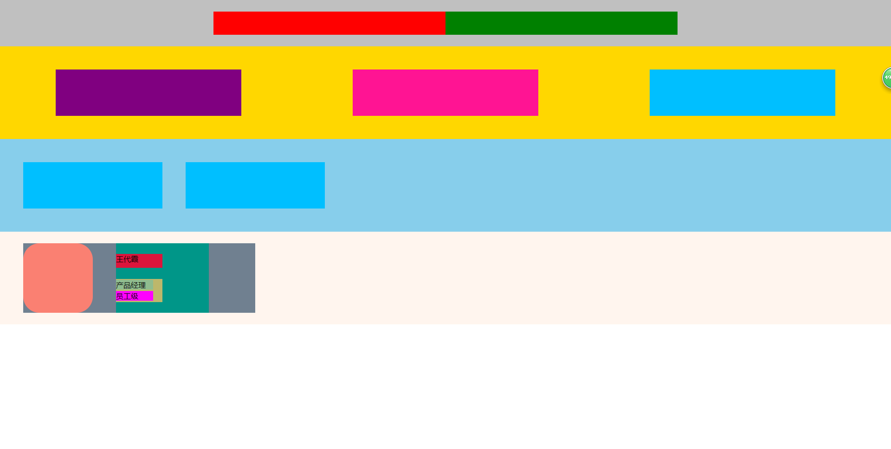

```js
<!DOCTYPE html>
<html lang="en">
<head>
    <meta charset="UTF-8">
    <meta name="viewport" content="width=device-width, initial-scale=1.0">
    <meta http-equiv="X-UA-Compatible" content="ie=edge">
    <title>Flex</title>
    <style>
        *{
            padding: 0;
            margin: 0;
        }
        /* body{
            height: 100%;
        } */
       
        .box1{
            height: 100%;
            display: flex;
            flex-direction: column;
            height: 100%;
        }
        .inner-1{
            display: flex;
            align-items: center;
            height: 100px;
            background: silver;    
            justify-content: center;    
        }
        .inner-box-1{
            display: flex;
            width: 1000px;
            background: yellowgreen;
            height: 50px;
        }
        .inner-inner-1{
            width: 500px;
            background: red;
            height: 50px;    
        }
        .inner-inner-2{
            width: 500px;
            background: green;
            height: 50px; 
        }
        .inner-2{
            height: 100px;
            background: gold;
            height: 200px;
            display: flex;
            width: 100%;
            justify-content:space-around;
            align-items: center;
        }
        .inner-2 >.inner-inner1-1{
            height: 100px;
            width: 400px;
            background: purple;
        }
        .inner-2 >.inner-inner1-2{
            height: 100px;
            width: 400px;
            background: deeppink;
        }
        .inner-2 >.inner-inner1-3{
            height: 100px;
            width: 400px;
            background: deepskyblue;
        }
        .inner-3{
            height: 150px;
            background: skyblue;
            height: 200px;
            display: flex;
            justify-content: flex-start;
            align-items: center; 
        }
        .inner-3 >.inner-inner2-1{
            height: 100px;
            width: 300px;
            background: deepskyblue;
            margin-left: 50px;
        }
        .inner-3 >.inner-inner2-2{
            height: 100px;
            width: 300px;
            background: deepskyblue;
            margin-left: 50px;
        }
        .inner-4{
            display: flex;
            align-items: center;
            background: seashell;
            height: 200px;
            padding-left:50px; 
        }
        .inner-4-box{
            width: 500px;
            height: 150px;
            background: slategrey;
            display: flex;

        }
        .inner-4-imgbox{
            width: 150px;
            height: 150px;
        }
        .inner-4-img{
            width: 148px;
            height: 148px;
            border: salmon dotted 1px;
            border-radius: 35px;
            background: salmon;
        }
        .inner-4-textbox{
            width: 200px;
            height: 150px;
            background:rgba(0,150,136,1);
            display: flex;
            flex-direction: column;
            justify-content: space-evenly;
            margin-left: 50px;
        }
        .inner-4-textbox-top{
            height: 30px;
            width: 100px;
            background: crimson;
        }
        .inner-4-textbox-bottom{
            height: 50px;
            width: 100px;
            background:darkkhaki;
            display: flex;
            flex-direction: column;
            justify-content:space-evenly;
        }
        .inner-4-textbox-bottom-first{
            width: 80px;
            height: 21px;
            background: darkseagreen;
        }
        .inner-4-textbox-bottom-second{
            width: 80px;
            height: 21px;
            background:fuchsia;
        }
    </style>
</head>
<body>
    <div class="box1">
        <div class="inner-1">
            <div class="inner-box-1">
                <div class="inner-inner-1"></div>
                <div class="inner-inner-2"></div>
            </div>
        </div>
        <div class="inner-2">
            <div class="inner-inner1-1"></div>
            <div class="inner-inner1-2"></div>
            <div class="inner-inner1-3"></div>
        </div>
        <div class="inner-3">
            <div class="inner-inner2-1"></div>
            <div class="inner-inner2-2"></div>
        </div>
        <div class="inner-4">
            <div class="inner-4-box">
                <div class="inner-4-imgbox">
                    <div class="inner-4-img"></div>
                </div>
                <div class="inner-4-textbox">
                    <div class="inner-4-textbox-top">
                        <p>王代霞</p>
                    </div>
                    <div class="inner-4-textbox-bottom">
                        <div class="inner-4-textbox-bottom-first">产品经理</div>
                        <div class="inner-4-textbox-bottom-second">员工级</div>
                    </div>
                </div>
            </div>
        </div>
    </div>
</body>
</html>
```

