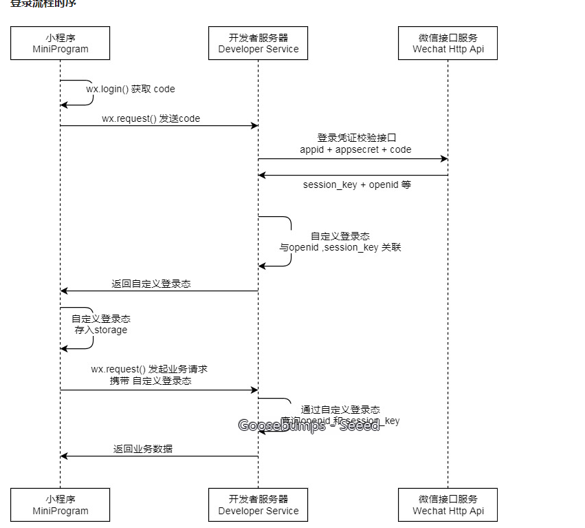

第一步   安装

- 全局安装 vue-cli
  - $ npm install --global vue-cli

- 创建一个基于 mpvue-quickstart 模板的新项目
  - $ vue init mpvue/mpvue-quickstart my-project

- 安装依赖
  - $ cd my-project
    $ npm install

- 启动构建-
  - $ npm run dev

第二步 启动项目


项目结构分析

每个index页面都要有一个index.vue 和 一个main.js

```js
main.js 都要有这个一段代码

import Vue from 'vue'
import App from './index'

const app = new Vue(App)
app.$mount()

```

 // 调用API从本地缓存中获取数据

   

app.json是微信小程序里面配置页面顺序的东西把

导入项目导入 dist 的 wx

配置vuex

登录功能



根据不同的用户登录推送不同的课程

开发开发设置配置域名 

在utils中配置接口

appid + appsecret + code

