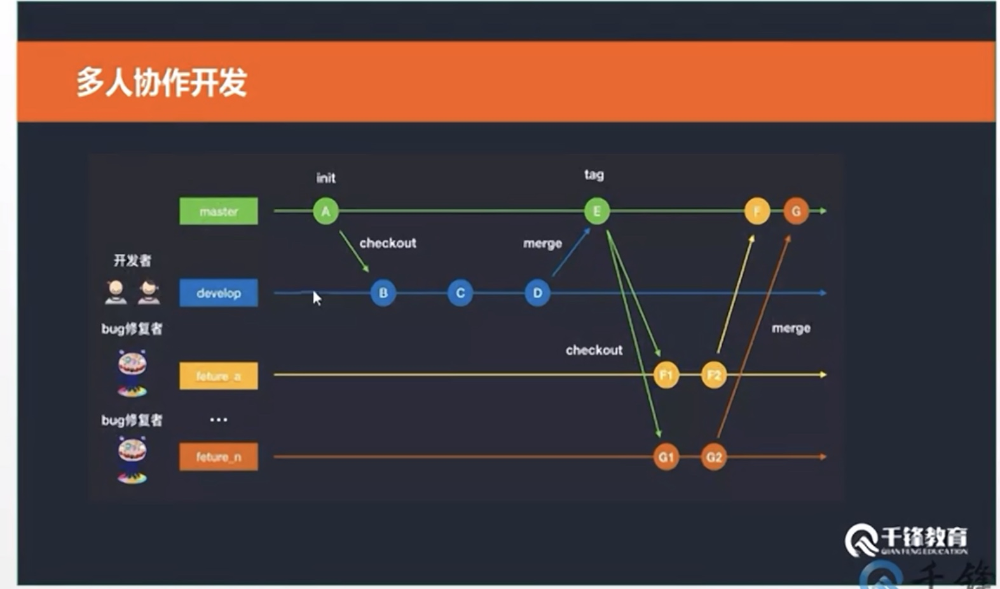
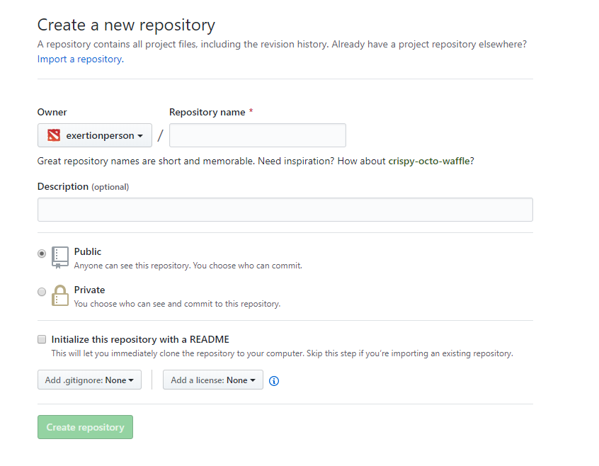

## 

### 项目流程

产品立项	

​	客户的需求分析

​	整理的需求分档

​	项目成立会

产品原型

​	产品原型图-- Axure RP工具等

​	UI设计 -- PS工具，AI工具等

项目需求分析

项目工期评估

项目责任划分

前端	

​		静态页面制作

​		前端框架选型

​		前端页面架构

后端	

​		数据库开发

​		API接口文档

​		API接口实现

开发测试

​		单元测试

​		E2E测试

灰度测试

​		功能测试

​		压力测试

​		服务器测试

​		用例测试

线上测试

​		指定群体测试	

​		反馈收集

​		版本迭代	

项目上线（运维来做）

​		打包前端模块

​		远程服务器部署

​		监控异常


### 多人协作开发与静态布局

### 初始化项目

静态布局demo

数据接口api

vue脚手架搭建

创建远程仓库


vue create wuxin

初始化项目 

3.0 默认自带git

### GIT

然后把项目发布到远程仓库上

打开自己的git仓库 点击右上角的仓库



到文件目录 Git bash

git remote

git remote add origin ssh 链接

ssh可以不用验证提交

git remote

origin

git push origin master

如果报错fatal 失败什么的 是由于私键问题

```js
首先你要去官网下载对应 Github bash并安装，可以查百度，有很多下载链接和安装的过程。

在 github 上添加 SSH key 的步骤： 
1、运行 git Bash 客户端，输入如下代码：

$ cd ~/.ssh
$ ls
1
2
这两个命令就是检查是否已经存在 id_rsa.pub 或 id_dsa.pub 文件，如果文件已经存在，那么你可以跳过步骤2，直接进入步骤3。

2、创建一个 SSH key

$ ssh-keygen -t rsa -C "your_email@example.com"
1
代码参数含义： 
-t 指定密钥类型，默认是 rsa ，可以省略。 
-C 设置注释文字，比如邮箱。 
-f 指定密钥文件存储文件名。

以上代码省略了 -f 参数，因此，运行上面那条命令后会让你输入一个文件名，用于保存刚才生成的 SSH key 代码，如：

Generating public/private rsa key pair.
# Enter file in which to save the key (/c/Users/you/.ssh/id_rsa): [Press enter]
1
2
当然，你也可以不输入文件名，使用默认文件名（推荐），那么就会生成 id_rsa 和 id_rsa.pub 两个秘钥文件。

接着又会提示你输入两次密码（该密码是你push文件的时候要输入的密码，而不是github管理者的密码）， 
当然，你也可以不输入密码，直接按回车。那么push的时候就不需要输入密码，直接提交到github上了，如：

Enter passphrase (empty for no passphrase): 
# Enter same passphrase again:
1
2
接下来，就会显示如下代码提示，如：

Your identification has been saved in /c/Users/you/.ssh/id_rsa.
# Your public key has been saved in /c/Users/you/.ssh/id_rsa.pub.
# The key fingerprint is:
# 01:0f:f4:3b:ca:85:d6:17:a1:7d:f0:68:9d:f0:a2:db your_email@example.com
1
2
3
4
当你看到上面这段代码的收，那就说明，你的 SSH key 已经创建成功，你只需要添加到github的SSH key上就可以了。

3、添加你的 SSH key 到 github上面去 
a、首先你需要拷贝 id_rsa.pub 文件的内容，你可以用编辑器打开文件复制，也可以用git命令复制该文件的内容，如：

$ clip < ~/.ssh/id_rsa.pub
1
b、登录你的github账号，从又上角的设置（ Account Settings ）进入，然后点击菜单栏的 SSH key 进入页面添加 SSH key。 
c、点击 Add SSH key 按钮添加一个 SSH key 。把你复制的 SSH key 代码粘贴到 key 所对应的输入框中，记得 SSH key 代码的前后不要留有空格或者回车。当然，上面的 Title 所对应的输入框你也可以输入一个该 SSH key 显示在 github 上的一个别名。默认的会使用你的邮件名称。

4、测试一下该SSH key 
首先要给github bash输入一下代码

$ ssh -T git@github.com
1
当你输入以上代码时，会有一段警告代码，如：

The authenticity of host 'github.com (207.97.227.239)' can't be established.
# RSA key fingerprint is 16:27:ac:a5:76:28:2d:36:63:1b:56:4d:eb:df:a6:48.
# Are you sure you want to continue connecting (yes/no)?
1
2
3
这是正常的，你输入 yes 回车既可。如果你创建 SSH key 的时候设置了密码，接下来就会提示你输入密码，如：

Enter passphrase for key '/c/Users/Administrator/.ssh/id_rsa':
1
当然如果你密码输错了，会再要求你输入，知道对了为止。 
注意：输入密码时如果输错一个字就会不正确，使用删除键是无法更正的。 
密码正确后你会看到下面这段话，如：

Hi username! You've successfully authenticated, but GitHub does not
# provide shell access.
1
2
如果用户名是正确的,你已经成功设置SSH密钥。如果你看到 “access denied” ，者表示拒绝访问，那么你就需要使用 https 去访问，而不是 SSH 。

其中还要对Github上的ssh key进行配置（添加一个新的key）： 
在个人信息模块找到自己的setting值中心，然后在左边栏里找到SSH and GPG keys这一栏，点击出现创建的新的key（New SSH key按钮）开始创建新的key，如下图： 

在创建成功之后会出现如下图片： 

在未配置成功的时候，左边的钥匙为灰色，当完成（4、测试一下该SSH key）之后，出现成功提示后，刷新代码就会变成如上图所示的绿色图标。

```

之后 

git push origin master 你的私匙就变绿了成功了 

不要在主分支开发

$ git checkout -b dev
Switched to a new branch 'dev'

新建一个开发分支并切换到开发分支上

git push origin dev

把开发分支push上去

开发的时候创建一个自己的分支，在自己的分支更改

$ git checkout -b createCompontents
Switched to a new branch 'createCompontents'

### 路由配置与初始化代码

assets文件里的图片会变成base64位编码

views里面是页面级的组件

components里面是公共的组件

创建routers 和 stores文件夹

里面文件起名叫 index.js脚手架默认使用index文件减少一层..

##### `路由加载的学问`

routes: [

​    {

​      path: '/',

​      name: 'home',

​      component: Home //项目运行一开始组件就会去加载 项目大了不太好

​    },

​    // {

​    //   path: '/about',

​    //   name: 'about',

​      // route level code-splitting

​      // this generates a separate chunk (about.[hash].js) for this route

​      // which is lazy-loaded when the route is visited.

​      //按需加载切换到这个路由上这个路由才会进行加载

​    //   component: () => import(/* webpackChunkName: "about" */ './views/About.vue')

​    // }

  ]

由于vscode 直接输入s tab就会有默认模板

路由配置

```js
cinema/index.js

export default {
    path : '/cinema',
    component: () => import ('@/views/Cinema') 
}
@默认是src目录 

index.js

import Vue from 'vue'
import Router from 'vue-router'
import movieRouter from './movie'
import mineRouter from './mine'
import cinemaRouter from './cinema'

Vue.use(Router)

export default new Router({
  mode: 'history',
  base: process.env.BASE_URL,
  routes: [
    movieRouter,
    mineRouter,
    cinemaRouter
  ]
})

```

### 头部组件与底部导航组件

引入一些静态资源

<meta name="viewport" content="width=device-width,initial-scale=1.0,user-scalable=no">
禁止缩放

<link rel="icon" href="<%= BASE_URL %>favicon.ico">

BASE_URL是跟据 路由中  base: process.env.BASE_URL, 相对应的资源可以不是在根目录上可以根据一个 base 这个路径

name  属性可以 在调试的时候方便调试  所以要设置

app.vue

 <keep-alive>

​          <router-view/>

​      </keep-alive>

切换会重加载页面 ，这个标签有个缓存的作用

vue自带属性router-link被选中的样式

 \#footer ul li.active {

​    color: #f03d37;

​    }

 \#footer ul li.router-link-active{

​    color: #f03d37;

​    }


##### props 父向子传值在项目中的应用


```html
子组件
<template>

​        <header id="header">

​            <h1>{{ title }}</h1>

​        </header>

</template>

<script>

export default {

  name: "Header",

  props : {

​      title : {

​          type: String,

​          default : '喵喵影院' 

​      }

  }

};
```


 <div id="main">
        <Header title="我的影院"/>
        <TabBar />
    </div>

```html
父组件 
<div id="main">
        <Header title="我的影院"/>
        <TabBar />
    </div>
```


  <div id="main">
        <Header title="我的影院"/>
        <TabBar />
    </div>

### 电影路由与组件拆分

把四个 电影 上的路由 可以是组件可以是页面

重定向到 `/movie`

  {

​      path: '/*',

​      redirect: '/movie'

​    }

/images/movie_1.jpg

加上/ 代表绝对路径

```js
export default {
    path : '/movie',
    component: () => import ('@/views/Movie'),
    children : [
        {
            path: 'city',
            component: () => import('@/components/City')
        },
        {
            path: 'nowPlaying',
            component : () => import('@/components/NowPlaying')
        },
        {
            path: 'comingSoon',
            component : () => import('@/components/ComingSoon')
        },
        {
            path: 'search',
            component : () => import('@/components/Search')
        },
        {
            path: '/movie',
            redirect: '/movie/nowPlaying'
        }
    ],
    
}
```

### 影院组件与登录组件

主要做了影院组件和登录组件的操作

```shell
Lenovo@LAPTOP-A8AP6GHM MINGW64 /d/Web/Vue/wuxin (dev)
$ git checkout -b createCompontents     创建选择分支
Switched to a new branch 'createCompontents'

Lenovo@LAPTOP-A8AP6GHM MINGW64 /d/Web/Vue/wuxin (createCompontents)
$ ^C

Lenovo@LAPTOP-A8AP6GHM MINGW64 /d/Web/Vue/wuxin (createCompontents)
$ git status						    查看修改内容
On branch createCompontents
Changes not staged for commit:
  (use "git add/rm <file>..." to update what will be committed)
  (use "git checkout -- <file>..." to discard changes in working directory)

        modified:   public/index.html
        modified:   src/App.vue
        deleted:    src/components/HelloWorld.vue
        modified:   src/main.js
        deleted:    src/router.js
        deleted:    src/store.js
        deleted:    src/views/About.vue
        deleted:    src/views/Home.vue

Untracked files:
  (use "git add <file>..." to include in what will be committed)

        public/css/
        public/images/
        public/libs/
        src/components/CiList/
        src/components/City/
        src/components/ComingSoon/
        src/components/Header/
        src/components/Login/
        src/components/NowPlaying/
        src/components/Search/
        src/components/TabBar/
        src/routers/
        src/stores/
        src/views/Cinema/
        src/views/Mine/
        src/views/Movie/

no changes added to commit (use "git add" and/or "git commit -a")

Lenovo@LAPTOP-A8AP6GHM MINGW64 /d/Web/Vue/wuxin (createCompontents)
$ git add .                            全部提交
warning: LF will be replaced by CRLF in public/index.html.
The file will have its original line endings in your working directory
warning: LF will be replaced by CRLF in src/App.vue.
The file will have its original line endings in your working directory
warning: LF will be replaced by CRLF in public/css/iconfont/iconfont.css.
The file will have its original line endings in your working directory
warning: LF will be replaced by CRLF in public/css/iconfont/iconfont.svg.
The file will have its original line endings in your working directory
warning: LF will be replaced by CRLF in public/libs/swiper-4.1.0.min.css.
The file will have its original line endings in your working directory
warning: LF will be replaced by CRLF in public/libs/swiper-4.1.0.min.js.
The file will have its original line endings in your working directory
warning: LF will be replaced by CRLF in public/libs/zepto.js.
The file will have its original line endings in your working directory
warning: LF will be replaced by CRLF in src/routers/index.js.
The file will have its original line endings in your working directory
warning: LF will be replaced by CRLF in src/stores/index.js.
The file will have its original line endings in your working directory

Lenovo@LAPTOP-A8AP6GHM MINGW64 /d/Web/Vue/wuxin (createCompontents)
$ git commit -m "add createComponents"  创建一个版本给这个分支起一个注释名字

[createCompontents 0dfb184] add createComponents
 35 files changed, 2820 insertions(+), 137 deletions(-)
 create mode 100644 public/css/common.css
 create mode 100644 public/css/iconfont/iconfont.css
 create mode 100644 public/css/iconfont/iconfont.eot
 create mode 100644 public/css/iconfont/iconfont.svg
 create mode 100644 public/css/iconfont/iconfont.ttf
 create mode 100644 public/css/iconfont/iconfont.woff
 create mode 100644 public/images/movie_1.jpg
 create mode 100644 public/images/movie_2.jpg
 create mode 100644 public/images/person_1.webp
 create mode 100644 public/libs/swiper-4.1.0.min.css
 create mode 100644 public/libs/swiper-4.1.0.min.js
 create mode 100644 public/libs/zepto.js
 rewrite src/App.vue (85%)
 create mode 100644 src/components/CiList/index.vue
 create mode 100644 src/components/City/index.vue
 create mode 100644 src/components/ComingSoon/index.vue
 create mode 100644 src/components/Header/index.vue
 delete mode 100644 src/components/HelloWorld.vue
 create mode 100644 src/components/Login/index.vue
 create mode 100644 src/components/NowPlaying/index.vue
 create mode 100644 src/components/Search/index.vue
 create mode 100644 src/components/TabBar/index.vue
 delete mode 100644 src/router.js
 create mode 100644 src/routers/cinema/index.js
 create mode 100644 src/routers/index.js
 create mode 100644 src/routers/mine/index.js
 create mode 100644 src/routers/movie/index.js
 rename src/{store.js => stores/index.js} (100%)
 delete mode 100644 src/views/About.vue
 create mode 100644 src/views/Cinema/index.vue
 delete mode 100644 src/views/Home.vue
 create mode 100644 src/views/Mine/index.vue
 create mode 100644 src/views/Movie/index.vue

Lenovo@LAPTOP-A8AP6GHM MINGW64 /d/Web/Vue/wuxin (createCompontents)
$ git checkout dev               		 切换到开发分支
Switched to branch 'dev'

Lenovo@LAPTOP-A8AP6GHM MINGW64 /d/Web/Vue/wuxin (dev)
$ git merge createComponents --no-ff	合并分支
		--no-ff是代表合并时会把合并记录会添加到gitlog上  方便查看
        然后让你写合并分支的注释  ：q 退出   默认的就行
merge: createComponents - not something we can merge

Lenovo@LAPTOP-A8AP6GHM MINGW64 /d/Web/Vue/wuxin (dev)
$ ^C

Lenovo@LAPTOP-A8AP6GHM MINGW64 /d/Web/Vue/wuxin (dev)
$ git merge createCompontents --no-ff
Removing src/views/Home.vue
Removing src/views/About.vue
Removing src/router.js
Removing src/components/HelloWorld.vue
Merge made by the 'recursive' strategy.
 public/css/common.css               |  116 +++
 public/css/iconfont/iconfont.css    |   29 +
 public/css/iconfont/iconfont.eot    |  Bin 0 -> 2900 bytes
 public/css/iconfont/iconfont.svg    |   44 +
 public/css/iconfont/iconfont.ttf    |  Bin 0 -> 2732 bytes
 public/css/iconfont/iconfont.woff   |  Bin 0 -> 1872 bytes
 public/images/movie_1.jpg           |  Bin 0 -> 18777 bytes
 public/images/movie_2.jpg           |  Bin 0 -> 11653 bytes
 public/images/person_1.webp         |  Bin 0 -> 5070 bytes
 public/index.html                   |    5 +-
 public/libs/swiper-4.1.0.min.css    |   12 +
 public/libs/swiper-4.1.0.min.js     |   13 +
 public/libs/zepto.js                | 1705 +++++++++++++++++++++++++++++++++++
 src/App.vue                         |   26 +-
 src/components/CiList/index.vue     |  112 +++
 src/components/City/index.vue       |  108 +++
 src/components/ComingSoon/index.vue |  125 +++
 src/components/Header/index.vue     |   41 +
 src/components/HelloWorld.vue       |   57 --
 src/components/Login/index.vue      |   33 +
 src/components/NowPlaying/index.vue |  124 +++
 src/components/Search/index.vue     |   57 ++
 src/components/TabBar/index.vue     |   59 ++
 src/main.js                         |    4 +-
 src/router.js                       |   25 -
 src/routers/cinema/index.js         |    4 +
 src/routers/index.js                |   21 +
 src/routers/mine/index.js           |    4 +
 src/routers/movie/index.js          |   27 +
 src/{store.js => stores/index.js}   |    0
 src/views/About.vue                 |    5 -
 src/views/Cinema/index.vue          |   40 +
 src/views/Home.vue                  |   18 -
 src/views/Mine/index.vue            |   28 +
 src/views/Movie/index.vue           |  101 +++
 35 files changed, 2813 insertions(+), 130 deletions(-)
 create mode 100644 public/css/common.css
 create mode 100644 public/css/iconfont/iconfont.css
 create mode 100644 public/css/iconfont/iconfont.eot
 create mode 100644 public/css/iconfont/iconfont.svg
 create mode 100644 public/css/iconfont/iconfont.ttf
 create mode 100644 public/css/iconfont/iconfont.woff
 create mode 100644 public/images/movie_1.jpg
 create mode 100644 public/images/movie_2.jpg
 create mode 100644 public/images/person_1.webp
 create mode 100644 public/libs/swiper-4.1.0.min.css
 create mode 100644 public/libs/swiper-4.1.0.min.js
 create mode 100644 public/libs/zepto.js
 create mode 100644 src/components/CiList/index.vue
 create mode 100644 src/components/City/index.vue
 create mode 100644 src/components/ComingSoon/index.vue
 create mode 100644 src/components/Header/index.vue
 delete mode 100644 src/components/HelloWorld.vue
 create mode 100644 src/components/Login/index.vue
 create mode 100644 src/components/NowPlaying/index.vue
 create mode 100644 src/components/Search/index.vue
 create mode 100644 src/components/TabBar/index.vue
 delete mode 100644 src/router.js
 create mode 100644 src/routers/cinema/index.js
 create mode 100644 src/routers/index.js
 create mode 100644 src/routers/mine/index.js
 create mode 100644 src/routers/movie/index.js
 rename src/{store.js => stores/index.js} (100%)
 delete mode 100644 src/views/About.vue
 create mode 100644 src/views/Cinema/index.vue
 delete mode 100644 src/views/Home.vue
 create mode 100644 src/views/Mine/index.vue
 create mode 100644 src/views/Movie/index.vue

Lenovo@LAPTOP-A8AP6GHM MINGW64 /d/Web/Vue/wuxin (dev)
$ git log                      查看日志 
commit cefde28935ef1490c83791693c4f87c267f954a9 (HEAD -> dev)
Merge: 412d322 0dfb184
Author: wuxin <1554214921@qq.com>
Date:   Sun May 26 00:34:57 2019 +0800

    Merge branch 'createCompontents' into dev

commit 0dfb184359e4178dc8ef61a8bb803406d98c5e3e (createCompontents)
Author: wuxin <1554214921@qq.com>
Date:   Sun May 26 00:32:49 2019 +0800

    add createComponents

commit 412d322803fbc4f97194fdb49f74f701ee0b53b7 (origin/master, origin/dev, master)
Author: wuxin <1554214921@qq.com>
Date:   Sat May 25 13:55:08 2019 +0800

    init

Lenovo@LAPTOP-A8AP6GHM MINGW64 /d/Web/Vue/wuxin (dev)
$ git push origin dev                         push到远程仓库
Enumerating objects: 65, done.
Counting objects: 100% (65/65), done.
Delta compression using up to 4 threads
Compressing objects: 100% (42/42), done.
Writing objects: 100% (57/57), 103.28 KiB | 421.00 KiB/s, done.
Total 57 (delta 5), reused 0 (delta 0)
remote: Resolving deltas: 100% (5/5), completed with 3 local objects.
To github.com:exertionperson/wuxin.git
   412d322..cefde28  dev -> dev

Lenovo@LAPTOP-A8AP6GHM MINGW64 /d/Web/Vue/wuxin (dev)
$ git branch								查看分支
  createCompontents
* dev
  master

Lenovo@LAPTOP-A8AP6GHM MINGW64 /d/Web/Vue/wuxin (dev)
$ git branch -d createCompontents			删除分支
Deleted branch createCompontents (was 0dfb184).

Lenovo@LAPTOP-A8AP6GHM MINGW64 /d/Web/Vue/wuxin (dev)
$ git branch								查看分支
* dev
  master


```

### 城市组件数据渲染（上）

先创建个分支

```sheel
$ git checkout -b setData
Switched to a new branch 'setData'
```

在项目的根目录下创建一个 vue.config.js 文件  配置文件

具体字段官网查阅

反向代理

```js
配置跨域
module.exports = {
	devServer : {
		proxy : {
			'/api' : {
				target : 'http://39.97.33.178',
				changeOrigin : true
			}
		}
	}
}
```

vue就是一个类 ，可以在它身上添加一些方法

安装axios并在 City试用

```js
	mounted(){
		this.axios.get('/api/cityList').then((res)=>{
		//原生js实现一下城市分组
			const msg = res.data.msg;
			if(msg === 'ok'){
				const data = res.data.data.cities;
				//把数据改造成这样有利于渲染
				// [ { index : 'A' , list : [{ nm : '阿城' , id : 123 }] } ] 
				formatCityList(cities);
			}
		})
	},
```

对数据改造

```js
export default {
	name: "City",
	mounted(){
		this.axios.get('/api/cityList').then((res)=>{
		//原生js实现一下城市分组
			const msg = res.data.msg;
			if(msg === 'ok'){
				let cities = res.data.data.cities;
//把数据改造成这样有利于渲染
// [ { index : 'A' , list : [{ nm : '阿城' , id : 123 }] } ] 
				
				this.formatCityList(cities);
			}
		})
	},
	methods : {
		formatCityList(cities){
				const cityList = [];
				const hotList = [];

for(let i = 0;i<cities.length;i++){
let firstLetter=cities[i].py.substring(0,1).toUpperCase();
//如果firstLetter在结果集中就走false 不在就走true
   if(toCom(firstLetter)){//新添加index
	  cityList.push({ index : firstLetter , list : [ { nm : cities[i].nm , id : cities[i].id } ] })
	  }else{ //累加到已有index中  
         for(var j=0;j<cityList.length;j++){
			if(cityList[j].index === firstLetter ){                               cityList[j].list.push( { nm : cities[i].nm , id : cities[i].id } )
								}
							} 
						}
				}

				cityList.sort(( n1,n2 ) => {  // 排序
					if( n1.index > n2.index){
						return 1;
					}
					else if(n1.index < n2.index){
						return -1;
					}
					else{
						return 0;
					}
				})
				//确定数组里有没有索引   有返回 false 没有返回 true
				function toCom(firstLetter){
					for(var i = 0;i<cityList.length;i++){
						if(cityList[i].index === firstLetter){
							return false;
						}
					}
					return true;
				}
				console.log( cityList )
		}
	}
};
```

```js
作了热门城市检索的更改
methods : {
		formatCityList(cities){
				const cityList = [];
				const hotList = [];

				for(let i = 0;i < cities.length;i++){
					if(cities[i].isHot === 1){
						hotList.push( cities[i] )
					}
				}

				for(let i = 0;i<cities.length;i++){
						let firstLetter = cities[i].py.substring(0,1).toUpperCase();
						//如果firstLetter在结果集中就走false 不在就走true
						if(toCom(firstLetter)){//新添加index
							cityList.push({ index : firstLetter , list : [ { nm : cities[i].nm , id : cities[i].id } ] })
						}else{ //累加到已有index中  
							for(var j=0;j<cityList.length;j++){
								if(cityList[j].index === firstLetter ){
								   cityList[j].list.push( { nm : cities[i].nm , id : cities[i].id } )
								}
							} 
						}
				}

				cityList.sort(( n1,n2 ) => {  // 排序
					if( n1.index > n2.index){
						return 1;
					}
					else if(n1.index < n2.index){
						return -1;
					}
					else{
						return 0;
					}
				})
				//确定数组里有没有索引   有返回 false 没有返回 true
				function toCom(firstLetter){
					for(var i = 0;i<cityList.length;i++){
						if(cityList[i].index === firstLetter){
							return false;
						}
					}
					return true;
				}
				return {
					cityList,
					hotList
				}
		}
	}
```


### 城市组件数据渲染（下）

```js
全部代码
<div class="citybody">
    <div class="citylist" ref="city_list">
        <div class="cityindex">
            <ul>
            <li v-for="(item,index) in cityList" :key = "item.index" @touchstart="handleToIndex(index)">{{ item.index }}</li>
            </ul>
        </div>

    <div class="cityhot">
        <h2>热门城市</h2>
		<ul class="clearfix">
   			 <li v-for="item in hotList" :key="item.id">{{ item.nm }}</li>
		</ul>
	</div>

	<div class="citysort" ref="city_sort">
   		 <div v-for="item in cityList" :key="item.index">
        	<h2 class="h2">{{ item.index }}</h2>
			<ul>
            <li v-for="itemList in item.list" :key="itemList.id">{{ itemList.nm }}</li>
			</ul>
		</div>
	</div>
</div>	
</div>
</template>

<script>

export default {
	name: "City",
	data(){
		return{
			cityList: [],
			hotList: [],
		}
	},
	mounted(){
		this.axios.get('/api/cityList').then((res)=>{
		//原生js实现一下城市分组
			const msg = res.data.msg;
			if(msg === 'ok'){
				let cities = res.data.data.cities;
				//把数据改造成这样有利于渲染
				// [ { index : 'A' , list : [{ nm : '阿城' , id : 123 }] } ] 
				const { cityList , hotList } = this.formatCityList(cities);
				this.cityList = cityList;
				this.hotList = hotList;
			}
		})
	},
	methods : {
		formatCityList(cities){
				const cityList = [];
				const hotList = [];

				for(let i = 0;i < cities.length;i++){
					if(cities[i].isHot === 1){
						hotList.push( cities[i] )
					}
				}

				for(let i = 0;i<cities.length;i++){
						let firstLetter = cities[i].py.substring(0,1).toUpperCase();
						//如果firstLetter在结果集中就走false 不在就走true
						if(toCom(firstLetter)){//新添加index
							cityList.push({ index : firstLetter , list : [ { nm : cities[i].nm , id : cities[i].id } ] })
						}else{ //累加到已有index中  
							for(var j=0;j<cityList.length;j++){
								if(cityList[j].index === firstLetter ){
								   cityList[j].list.push( { nm : cities[i].nm , id : cities[i].id } )
								}
							} 
						}
				}

				cityList.sort(( n1,n2 ) => {  // 排序
					if( n1.index > n2.index){
						return 1;
					}
					else if(n1.index < n2.index){
						return -1;
					}
					else{
						return 0;
					}
				})
				//确定数组里有没有索引   有返回 false 没有返回 true
				function toCom(firstLetter){
					for(var i = 0;i<cityList.length;i++){
						if(cityList[i].index === firstLetter){
							return false;
						}
					}
					return true;
				}
				return {
					cityList,
					hotList
				}
		},
		handleToIndex(index){
			 var h2 = this.$refs.city_sort.getElementsByTagName('h2');
			//   this.$nextTick(() => {
             document.documentElement.scrollTop =  h2[index].offsetTop + 46;
//                 })

			//this.$refs.city_sort.parentNode.scrollTop = h2[index].offsetTop;
			//不好使 
			
            }
	}
};
```

处理点击跳转城市问题 用到了一些$refs还有一些dom操作

```js
<div class="citysort" ref="city_sort">
    
    handleToIndex(index){
			 var h2 = this.$refs.city_sort.getElementsByTagName('h2');
			//   this.$nextTick(() => {
             document.documentElement.scrollTop =  h2[index].offsetTop + 46;
//                 })

			//this.$refs.city_sort.parentNode.scrollTop = h2[index].offsetTop;
			//不好使 
			
            }
```


触摸事件具体在其他.md 内

```js
  <li v-for="(item,index) in cityList" :key = "item.index" @touchstart="handleToIndex(index)">{{ item.index }}</li>
```

