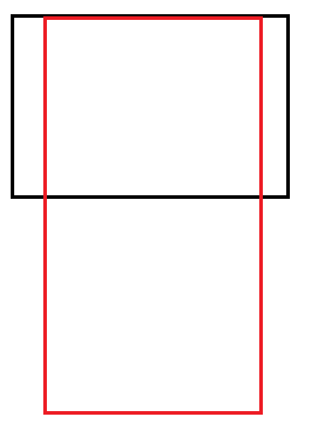

## 热映电影组件数据渲染

#### 1. 数据绑定

vue 指令以 *v-* 前缀标示，数据绑定的指令 *v-bind:属性名*, 简写为 *:属性名*, 简单的数据绑定例子如下：

```
<a v-bind:href="http://www.cnblogs.com/">博客园首页</a>

简写：
<a :href="http://www.cnblogs.com/">博客园首页</a>
```

过滤器

```js
全局过滤器
Vue.filter('setWH',(url,arg)=>{
    return url.replace(/w\.h/,arg);
})
```

```js
Nowplaying index.vue
<li v-for="item in movieList" :key="item.id">
	<div class="pic_show"></div>
		<div class="info_list">
			<h2>{{ item.nm }}</h2>
			<p>观众评 <span class="grade">{{ item.sc }}</span></p>
			<p>主演: {{ item.star }}</p>
			<p>{{ item.showInfo }}</p>
		</div>
		<div class="btn_mall">
				购票
		</div>
</li>
```

更改ComingSoon组件数据

```js
   <li v-for="item in comingList" :key="item.id">
                    <div class="pic_show"></div>
                    <div class="info_list">
                        <h2>{{ item.nm }}</h2>
                        <p><span class="person">{{ item.wish }}</span> 人想看</p>
                        <p>主演: {{ item.star }}</p>
                        <p>{{ item.rt }}上映</p>
                    </div>
                    <div class="btn_pre">
                        预售
                    </div>
                </li> 


export default {
  name: "ComingSoon",
  data(){
      return{
          comingList: []
      }
  },
  mounted(){
      this.axios.get('/api/movieComingList?cityId=10')
      .then((res) => {
          const msg  = res.data.msg;
          console.log(res)
          if(msg === 'ok'){
              this.comingList = res.data.data.comingList;
          }
      })
  }
};
```


## 搜索影片组件数据渲染

computed 不太适合做异步操作  在vue官网中有讲解

这里我们选择使用watch来监听属性可以做异步操作

计算属性和watch监听之间的关系

```js
watch监听
<input type="text" v-model="message">
         
 export default {
    name : 'Search',
    data(){
        return{
            message:"1111",
            movieList : [],
        } 
    },
    watch : {
        message(newVal){
            console.log(newVal)
        }
    }
}
```

函数防抖

```js
防止在输入过程中每一回都触发函数，快速输入不能每一回都执行方法 
```

```js
  <li v-for="item in moviesList" :key="item.id">
     <div class="img"></div>
      <div class="info">
   <p><span>{{ item.nm }}</span><span>{{ item.sc }}</span></p>
    <p>{{ item.enm }}</p>
    <p>{{ item.cat }}</p>
    <p>{{ item.rt }}</p>
</div>
</li> 

export default {
    name : 'Search',
    data(){
        return {
            message : '',
            moviesList : []
        }
    },
    methods : {
        cancelRequest(){
            if(typeof this.source ==='function'){
                this.source('终止请求')
            }
        }
    },
    watch : {
        message(newVal){
            var that = this;
            
            this.cancelRequest();
            this.axios.get('/api/searchList?cityId=10&kw='+newVal,{
                cancelToken: new this.axios.CancelToken(function(c){
                    that.source = c;
                })
            }).then((res)=>{
                var msg = res.data.msg;
                var movies = res.data.data.movies;
                if(msg && movies){
                    this.moviesList = res.data.data.movies.list;
                }
            }).catch((err) => {
                if (this.axios.isCancel(err)) {
                    console.log('Rquest canceled', err.message); //请求如果被取消，这里是返回取消的message
                } else {
                    //handle error
                    console.log(err);
                }
            });
        }
    }
}
</script>
```


## 影院组件数据渲染

vue官方规范不建议v-for和v-if一起写，建议我们要么把v-if写在外侧容器上里层式v-for，要么把v-for做一个计算属性实现一个筛选的功能

vue警告等级 一共3级

```js
  <li v-for="item in cinemaList" :key="item.id">
    <div>
      <span>{{ item.nm }}</span>
      <span class="q"><span class="price">{{ item.sellPrice }}</span> 元起</span>
        </div>
     <div class="address">
      <span>{{ item.addr }}</span>
      <span>{{ item.distance }}</span>
     </div>
     <div class="card">
          <!-- 只留num为一的 -->
     <div v-for="(num,key) in item.tag" v-if= "num === 1" :key="key" :class=" key | classCard ">
                        {{ key | formatCard }}
                    </div>
                </div>
            </li>
            
```

数据的加载以及过滤器的操作

```js
export default {
    name : 'CiList',
    data(){
        return{
            cinemaList : []
        }
    },
    mounted(){
        this.axios.get('/api/cinemaList?cityId=10')
        .then((res)=>{
            const msg = res.data.msg;
            if(msg === "ok"){
                this.cinemaList = res.data.data.cinemas
            }
        })
    },
    //过滤器操作
    filters : { 
        formatCard(key){
            let card = [
                { key : 'allowRefund' , value : '改签'},
                { key : 'endorse' , value : '退换'},
                { key : 'sell' , value : '折扣卡'},
                { key : 'snack' , value : '小吃'},
            ];
            for(let i = 0;i<card.length;i++){
               if(card[i].key === key){
                   return card[i].value;
               }     
            }
            return '';
        },
        对类样式绑定过滤器操作 
        classCard(key){
            let card = [
                { key : 'allowRefund' , value : 'bl'},
                { key : 'endorse' , value : 'bl'},
                { key : 'sell' , value : 'or'},
                { key : 'snack' , value : 'or'},
            ];
            for(let i = 0;i<card.length;i++){
               if(card[i].key === key){
                   return card[i].value;
               }     
            }
            return '';
        }
    }
}
```

这是我们所有的数据渲染以及做完

操作git

```shell

Lenovo@LAPTOP-A8AP6GHM MINGW64 /d/Web/Vue/wuxin (detailPage)
$ git status
On branch detailPage
Changes not staged for commit:
  (use "git add <file>..." to update what will be committed)
  (use "git checkout -- <file>..." to discard changes in working directory)

        modified:   package-lock.json
        modified:   package.json
        modified:   src/components/CiList/index.vue
        modified:   src/components/City/index.vue
        modified:   src/components/ComingSoon/index.vue
        modified:   src/components/Header/index.vue
        modified:   src/components/NowPlaying/index.vue
        modified:   src/components/Search/index.vue
        modified:   src/main.js
        modified:   src/routers/movie/index.js
        modified:   src/views/Movie/index.vue

Untracked files:
  (use "git add <file>..." to include in what will be committed)

        src/assets/maxs.png
        src/views/Movie/detail.vue
        vue.config.js

no changes added to commit (use "git add" and/or "git commit -a")

Lenovo@LAPTOP-A8AP6GHM MINGW64 /d/Web/Vue/wuxin (detailPage)
$ git add .
warning: LF will be replaced by CRLF in package-lock.json.
The file will have its original line endings in your working directory
warning: LF will be replaced by CRLF in package.json.
The file will have its original line endings in your working directory

Lenovo@LAPTOP-A8AP6GHM MINGW64 /d/Web/Vue/wuxin (detailPage)
$ git add .

Lenovo@LAPTOP-A8AP6GHM MINGW64 /d/Web/Vue/wuxin (detailPage)
$ git commit -m "add setData"
[detailPage 18d5a46] add setData
 14 files changed, 572 insertions(+), 384 deletions(-)
 create mode 100644 src/assets/maxs.png
 rewrite src/components/CiList/index.vue (62%)
 rewrite src/components/ComingSoon/index.vue (65%)
 rewrite src/components/NowPlaying/index.vue (60%)
 create mode 100644 src/views/Movie/detail.vue
 create mode 100644 vue.config.js

Lenovo@LAPTOP-A8AP6GHM MINGW64 /d/Web/Vue/wuxin (detailPage)
$ git checkout dev
Switched to branch 'dev'

Lenovo@LAPTOP-A8AP6GHM MINGW64 /d/Web/Vue/wuxin (dev)
$ git merge setData --no-ff   可以保留历史的合并分支

Lenovo@LAPTOP-A8AP6GHM MINGW64 /d/Web/Vue/wuxin (dev)
$ --no-ff
bash: --no-ff: command not found

Lenovo@LAPTOP-A8AP6GHM MINGW64 /d/Web/Vue/wuxin (dev)
$ ^C

Lenovo@LAPTOP-A8AP6GHM MINGW64 /d/Web/Vue/wuxin (dev)
$  git merge setData --no-ff^C
error: unknown option `no-ff^C'
usage: git merge [<options>] [<commit>...]
   or: git merge --abort
   or: git merge --continue

    -n                    do not show a diffstat at the end of the merge
    --stat                show a diffstat at the end of the merge
    --summary             (synonym to --stat)
    --log[=<n>]           add (at most <n>) entries from shortlog to merge commit message
    --squash              create a single commit instead of doing a merge
    --commit              perform a commit if the merge succeeds (default)
    -e, --edit            edit message before committing
    --ff                  allow fast-forward (default)
    --ff-only             abort if fast-forward is not possible
    --rerere-autoupdate   update the index with reused conflict resolution if possible
    --verify-signatures   verify that the named commit has a valid GPG signature
    -s, --strategy <strategy>
                          merge strategy to use
    -X, --strategy-option <option=value>
                          option for selected merge strategy
    -m, --message <message>
                          merge commit message (for a non-fast-forward merge)
    -F, --file <path>     read message from file
    -v, --verbose         be more verbose
    -q, --quiet           be more quiet
    --abort               abort the current in-progress merge
    --continue            continue the current in-progress merge
    --allow-unrelated-histories
                          allow merging unrelated histories
    --progress            force progress reporting
    -S, --gpg-sign[=<key-id>]
                          GPG sign commit
    --overwrite-ignore    update ignored files (default)
    --signoff             add Signed-off-by:
    --verify              verify commit-msg hook


Lenovo@LAPTOP-A8AP6GHM MINGW64 /d/Web/Vue/wuxin (dev)
$  git merge setData --no-ff
Already up to date.

Lenovo@LAPTOP-A8AP6GHM MINGW64 /d/Web/Vue/wuxin (dev)
$  git merge setData --no-ff
Already up to date.

Lenovo@LAPTOP-A8AP6GHM MINGW64 /d/Web/Vue/wuxin (dev)
$  git merge setData --no-ff
Already up to date.

Lenovo@LAPTOP-A8AP6GHM MINGW64 /d/Web/Vue/wuxin (dev)
$ git branch
  detailPage
* dev
  master
  setData

Lenovo@LAPTOP-A8AP6GHM MINGW64 /d/Web/Vue/wuxin (dev)
$ git merge setData --no-ff
Already up to date.

Lenovo@LAPTOP-A8AP6GHM MINGW64 /d/Web/Vue/wuxin (dev)
$ git log
commit cefde28935ef1490c83791693c4f87c267f954a9 (HEAD -> dev, origin/dev, setData)
Merge: 412d322 0dfb184
Author: wuxin <1554214921@qq.com>
Date:   Sun May 26 00:34:57 2019 +0800

    Merge branch 'createCompontents' into dev

commit 0dfb184359e4178dc8ef61a8bb803406d98c5e3e
Author: wuxin <1554214921@qq.com>
Date:   Sun May 26 00:32:49 2019 +0800

    add createComponents

commit 412d322803fbc4f97194fdb49f74f701ee0b53b7 (origin/master, master)
Author: wuxin <1554214921@qq.com>
Date:   Sat May 25 13:55:08 2019 +0800

    init

Lenovo@LAPTOP-A8AP6GHM MINGW64 /d/Web/Vue/wuxin (dev)
$ git status
On branch dev
nothing to commit, working tree clean

Lenovo@LAPTOP-A8AP6GHM MINGW64 /d/Web/Vue/wuxin (dev)
$ git branch
  detailPage
* dev
  master
  setData

Lenovo@LAPTOP-A8AP6GHM MINGW64 /d/Web/Vue/wuxin (dev)
$ checkout branch detailPage
bash: checkout: command not found

Lenovo@LAPTOP-A8AP6GHM MINGW64 /d/Web/Vue/wuxin (dev)
$ ^C

Lenovo@LAPTOP-A8AP6GHM MINGW64 /d/Web/Vue/wuxin (dev)
$ git checkout detailPage
Switched to branch 'detailPage'

Lenovo@LAPTOP-A8AP6GHM MINGW64 /d/Web/Vue/wuxin (detailPage)
$ git status
On branch detailPage
nothing to commit, working tree clean

Lenovo@LAPTOP-A8AP6GHM MINGW64 /d/Web/Vue/wuxin (detailPage)
$ git checkout dev
Switched to branch 'dev'

Lenovo@LAPTOP-A8AP6GHM MINGW64 /d/Web/Vue/wuxin (dev)
$ git merge detailPage --no-ff
Merge made by the 'recursive' strategy.
 package-lock.json                   |  17 +++--
 package.json                        |   1 +
 src/assets/maxs.png                 | Bin 0 -> 1768 bytes
 src/components/CiList/index.vue     | 125 +++++++++++++++---------------
 src/components/City/index.vue       | 147 ++++++++++++++++++++++++++++++++++--
 src/components/ComingSoon/index.vue | 108 +++++++-------------------
 src/components/Header/index.vue     |   2 +-
 src/components/NowPlaying/index.vue | 104 ++++++-------------------
 src/components/Search/index.vue     |  62 ++++++++++++---
 src/main.js                         |   5 ++
 src/routers/movie/index.js          |   6 ++
 src/views/Movie/detail.vue          | 102 +++++++++++++++++++++++++
 src/views/Movie/index.vue           |   2 +
 vue.config.js                       |  11 +++
 14 files changed, 440 insertions(+), 252 deletions(-)
 create mode 100644 src/assets/maxs.png
 create mode 100644 src/views/Movie/detail.vue
 create mode 100644 vue.config.js

Lenovo@LAPTOP-A8AP6GHM MINGW64 /d/Web/Vue/wuxin (dev)
$ git log
commit 3622f0f38f2b5acd46c91960e131eee9b676a054 (HEAD -> dev)
Merge: cefde28 18d5a46
Author: wuxin <1554214921@qq.com>
Date:   Sun Jun 2 11:13:03 2019 +0800

    Merge branch 'detailPage' into dev

commit 18d5a4684cf8720f745d6ad0856eafeb2b810db3 (detailPage)
Author: wuxin <1554214921@qq.com>
Date:   Sun Jun 2 11:03:26 2019 +0800

    add setData

commit cefde28935ef1490c83791693c4f87c267f954a9 (origin/dev, setData)
Merge: 412d322 0dfb184
Author: wuxin <1554214921@qq.com>
Date:   Sun May 26 00:34:57 2019 +0800

    Merge branch 'createCompontents' into dev

commit 0dfb184359e4178dc8ef61a8bb803406d98c5e3e
Author: wuxin <1554214921@qq.com>
Date:   Sun May 26 00:32:49 2019 +0800

Lenovo@LAPTOP-A8AP6GHM MINGW64 /d/Web/Vue/wuxin (dev)
$ git status
On branch dev
nothing to commit, working tree clean

Lenovo@LAPTOP-A8AP6GHM MINGW64 /d/Web/Vue/wuxin (dev)
$ git push origin dev
Enumerating objects: 55, done.
Counting objects: 100% (55/55), done.
Delta compression using up to 4 threads
Compressing objects: 100% (23/23), done.
Writing objects: 100% (30/30), 9.43 KiB | 567.00 KiB/s, done.
Total 30 (delta 13), reused 0 (delta 0)
remote: Resolving deltas: 100% (13/13), completed with 12 local objects.
To github.com:exertionperson/wuxin.git
   cefde28..3622f0f  dev -> dev

Lenovo@LAPTOP-A8AP6GHM MINGW64 /d/Web/Vue/wuxin (dev)
$ git merge setData --no-ff
Already up to date.

Lenovo@LAPTOP-A8AP6GHM MINGW64 /d/Web/Vue/wuxin (dev)
$ ^C

Lenovo@LAPTOP-A8AP6GHM MINGW64 /d/Web/Vue/wuxin (dev)
$ git branch -d setData
Deleted branch setData (was cefde28).

Lenovo@LAPTOP-A8AP6GHM MINGW64 /d/Web/Vue/wuxin (dev)
$ git branch
  detailPage
* dev
  master

Lenovo@LAPTOP-A8AP6GHM MINGW64 /d/Web/Vue/wuxin (dev)
$ git branch -d detailPage
Deleted branch detailPage (was 18d5a46).

Lenovo@LAPTOP-A8AP6GHM MINGW64 /d/Web/Vue/wuxin (dev)
$ git branch
* dev
  master

Lenovo@LAPTOP-A8AP6GHM MINGW64 /d/Web/Vue/wuxin (dev)
$ ^C


```


## 封装better-scroll组件（上）

当城市改变其他数据也跟着改变

```shell
git checkout -b getCity
```

移动端事件 touchstart  而不是 click click会有延迟 

 touchstart滑动时候也会触发不适合

tap 事件适合滑动时候不触发 点击触发  自己利用事件模拟

下面有三个技术选型都可以代替原生自己做

zepto    vue-touch    better-scroll

原生样式生硬，需要滑动流畅

iscroll  swiper  better-scroll

安装

```shell
npm i -S better-scroll
```

内层内容要比外面的容器大，内容一定要加载完毕才能触发功能



在NowPlaying 组件下开刀

```js
引入
import BScroll from 'better-scroll';
```

this.$nextTick(()=>{

​                    new BScroll( this.$refs.movie_body , {})

​                })

vue提供的$nextTick()方法在界面数据都渲染完再去触发这个方法的回调

下拉更新  具体api在其他文件

```html
 <div class="movie_body" ref="movie_body" id="scroll">
				<ul>
					<li class="pullDown">{{ pullDownMsg }}</li>
					<li v-for="item in movieList" :key="item.id">
						<div class="pic_show" @tap="hangleToDetail"></div>
						<!-- tap事件 -->
						<div class="info_list">
							<h2>{{ item.nm }}</h2>
							<p>观众评 <span class="grade">{{ item.sc }}</span></p>
							<p>主演: {{ item.star }}</p>
							<p>{{ item.showInfo }}</p>
						</div>
						<div class="btn_mall">
							购票
						</div>
					</li>
				</ul>
			</div>
```

```js
import BScroll from 'better-scroll';

export default {
	name : 'NowPlaying',
	data(){
		return{
			movieList : [],
			pullDownMsg : ''
		}
	},
	mounted(){
		this.axios.get('/api/movieOnInfoList?cityId=10')
		.then((res) => {
			const msg = res.data.msg;
			if( msg === 'ok'){
				this.movieList = res.data.data.movieList;
				// this.$nextTick(()=>{
				// 	new BScroll( this.$refs.movie_body , {});
				// })
				this.$nextTick(()=>{
                    var scroll = new BScroll( this.$refs.movie_body , {					
							tap : true,    //开启tap事件点击触发滑动不触发
							probeType: 1,  //滚动的时候会派发scroll事件  
					});

					scroll.on('scroll',(pos)=>{
						// 触发了上拉事件  pos是拖拽的值
						if(pos.y > 30){
							this.pullDownMsg = '正在更新中'
						}
					})
					
					scroll.on('touchEnd',(pos)=>{
					// 	// console.log('touchend') // 滑动结束触发事件
						if(pos.y > 30){
							this.axios.get('/api/movieOnInfoList?cityId=11')
							.then((res) => {
								const msg = res.data.msg;
								if( msg === 'ok'){
									this.pullDownMsg = '更新成功';
									setTimeout(()=>{
										this.movieList = res.data.data.movieList;
										this.pullDownMsg = ''	
									},1000)
								}
							})		
						}
					})
				})
			}
		})
	},
	methods : {
		hangleToDetail(){
			console.log('handleToDetail');
		}
	}
}
</script>
```


## 封装better-scroll组件（下）

很多组件都要使用把这个东西变成一个组件

```js
import Scroller from '@/components/Scroller'

Vue.component('Scroller',Scroller)
全局注册组件
```

```js
<template>
    <div class="wrapper">
        <slot></slot>
    </div>
</template>

<script>
export default {
    name:'Srcoller'
}
</script>

<style scoped>
    .wrapper{
        height: 100%;
    }
</style>

做一个插槽的操作

	<Scroller>
    <ul>
    <li class="pullDown">{{ pullDownMsg }}</li>
<li v-for="item in movieList" :key="item.id">
    <div class="pic_show" @tap="hangleToDetail"></div>
<!-- tap事件 -->
        <div class="info_list">
            <h2>{{ item.nm }}</h2>
<p>观众评 <span class="grade">{{ item.sc }}</span></p>
    <p>主演: {{ item.star }}</p>
<p>{{ item.showInfo }}</p>
</div>
<div class="btn_mall">
    购票
</div>
</li>
</ul>
</Scroller>
```


最后完成 

```js
父组件 
<div class="movie_body" ref="movie_body" id="scroll">
				<Scroller :handleToScroll="handleToScroll" :handleToTouchEnd="handleToTouchEnd">
				<ul>
					<li class="pullDown">{{ pullDownMsg }}</li>
					<li v-for="item in movieList" :key="item.id">
						<div class="pic_show" @tap="hangleToDetail"></div>
						<!-- tap事件 -->
						<div class="info_list">
							<h2>{{ item.nm }}</h2>
							<p>观众评 <span class="grade">{{ item.sc }}</span></p>
							<p>主演: {{ item.star }}</p>
							<p>{{ item.showInfo }}</p>
						</div>
						<div class="btn_mall">
							购票
						</div>
					</li>
				</ul>
				</Scroller>
			</div>
```

```js
methods : {
		hangleToDetail(){
			console.log('handleToDetail');
		},
		handleToScroll(pos){
			if(pos.y > 30){
				this.pullDownMsg = '正在更新中'
			}
		},
		handleToTouchEnd(pos){
			if(pos.y > 30){
				this.axios.get('/api/movieOnInfoList?cityId=11')
				.then((res) => {
					const msg = res.data.msg;
					if( msg === 'ok'){
						this.pullDownMsg = '更新成功';
						setTimeout(()=>{
							this.movieList = res.data.data.movieList;
							this.pullDownMsg = ''	
						},1000)
					}
				})		
			}
		}
	}
```


子组件

```js
<template>
    <div class="wrapper"  ref="wrapper">
        <slot></slot>
    </div>
</template>

<script>
import BScroll from 'better-scroll';

export default {
    name:'Srcoller',
    props : {
        handleToScroll : {
            type : Function,
            default : function(){}
        },
        handleToTouchEnd : {
            type : Function,
            default : function(){}
        },
    },
    mounted(){
        const scroll = new BScroll(this.$refs.wrapper,{
            tap : true,
            probeType : 1,
        });

        scroll.on('scroll',(pos) => {
            this.handleToScroll(pos)
        })

        scroll.on('touchEnd',(pos) => {
            this.handleToTouchEnd(pos)
        })
    }
}
</script>

<style scoped>
    .wrapper{
        height: 100%;
    }
</style>

```

aop思想

```js
最后封装版本
<template>
    <div class="wrapper"  ref="wrapper">
        <slot></slot>
    </div>
</template>

<script>
import BScroll from 'better-scroll';

export default {
    name:'Srcoller',
    props : {
        handleToScroll : {
            type : Function,
            default : function(){}
        },
        handleToTouchEnd : {
            type : Function,
            default : function(){}
        },
    },
    mounted(){
        const scroll = new BScroll(this.$refs.wrapper,{
            tap : true,
            probeType : 1,
        });

        this.scroll = scroll;
        //把这个属性变成全局
        scroll.on('scroll',(pos) => {
            this.handleToScroll(pos)
        })

        scroll.on('touchEnd',(pos) => {
            this.handleToTouchEnd(pos)
        })
    },
    methods : {
        toScrollTop(y){
            this.scroll.scrollTo(0,y);
        }
    }
}
</script>

<style scoped>
    .wrapper{
        height: 100%;
    }
</style>
```

```js
在其他组件直接引入就可以了
注意 里面只能包裹一个父容器 还有父短子长条件 #scroll{ height: 684px;}
<div id="content">
        <div class="movie_body" id='scroll'>
            <Scroller>
                <ul>
                    <!-- <li>
                        <div class="pic_show"></div>
                        <div class="info_list">
                            <h2>无名之辈</h2>
                            <p><span class="person">17746</span> 人想看</p>
                            <p>主演: 陈建斌,任素汐,潘斌龙</p>
                            <p>2018-11-30上映</p>
                        </div>
                        <div class="btn_pre">
                            预售
                        </div>
                    </li> -->

                    <li v-for="item in comingList" :key="item.id">
                        <div class="pic_show"></div>
                        <div class="info_list">
                            <h2>{{ item.nm }}</h2>
                            <p><span class="person">{{ item.wish }}</span> 人想看</p>
                            <p>主演: {{ item.star }}</p>
                            <p>{{ item.rt }}上映</p>
                        </div>
                        <div class="btn_pre">
                            预售
                        </div>
                    </li> 
                </ul>
            </Scroller>
        </div>
    </div>
```


better-scroll实现点击跳转

```js
封装的方法
methods : {
        toScrollTop(y){
            this.scroll.scrollTo(0,y);
        }
    }

city.vue内的方法

handleToIndex(index){
			 var h2 = this.$refs.city_sort.getElementsByTagName('h2');
			//   this.$nextTick(() => {
//              document.documentElement.scrollTop =  h2[index].offsetTop + 46;
//				加上better-scroll原生跳转不好使了
//                 })

			//this.$refs.city_sort.parentNode.scrollTop = h2[index].offsetTop;
			//不好使 

			this.$refs.city.toScrollTop(-h2[index].offsetTop);
			//因为网上滚动要加负号
            }
	}
};
```


## 封装loading组件

网速不好loading效果 

```js
<template>
    <div class="loader"></div>
</template>

<script>
export default {
    name : 'Loading'
}
</script>

<style scoped>
.loader {
  position: relative;
  width: 2.5em;
  height: 2.5em;
  transform: rotate(165deg);
}
.loader:before, .loader:after {
  content: '';
  position: absolute;
  top: 50%;
  left: 50%;
  display: block;
  width: 0.5em;
  height: 0.5em;
  border-radius: 0.25em;
  transform: translate(-50%, -50%);
}
.loader:before {
  animation: before 2s infinite;
}
.loader:after {
  animation: after 2s infinite;
}

@keyframes before {
  0% {
    width: 0.5em;
    box-shadow: 1em -0.5em rgba(225, 20, 98, 0.75), -1em 0.5em rgba(111, 202, 220, 0.75);
  }
  35% {
    width: 2.5em;
    box-shadow: 0 -0.5em rgba(225, 20, 98, 0.75), 0 0.5em rgba(111, 202, 220, 0.75);
  }
  70% {
    width: 0.5em;
    box-shadow: -1em -0.5em rgba(225, 20, 98, 0.75), 1em 0.5em rgba(111, 202, 220, 0.75);
  }
  100% {
    box-shadow: 1em -0.5em rgba(225, 20, 98, 0.75), -1em 0.5em rgba(111, 202, 220, 0.75);
  }
}
@keyframes after {
  0% {
    height: 0.5em;
    box-shadow: 0.5em 1em rgba(61, 184, 143, 0.75), -0.5em -1em rgba(233, 169, 32, 0.75);
  }
  35% {
    height: 2.5em;
    box-shadow: 0.5em 0 rgba(61, 184, 143, 0.75), -0.5em 0 rgba(233, 169, 32, 0.75);
  }
  70% {
    height: 0.5em;
    box-shadow: 0.5em -1em rgba(61, 184, 143, 0.75), -0.5em 1em rgba(233, 169, 32, 0.75);
  }
  100% {
    box-shadow: 0.5em 1em rgba(61, 184, 143, 0.75), -0.5em -1em rgba(233, 169, 32, 0.75);
  }
}
/**
 * Attempt to center the whole thing!
 */
html,
body {
  height: 100%;
}

.loader {
  position: absolute;
  top: calc(50% - 1.25em);
  left: calc(50% - 1.25em);
}

</style>

```

做成全局组件

在各个组件引用

```js
例子
<template>
        <div class="movie_body" id='scroll'>
            <Loading v-if="isLoading"/>
            <Scroller v-else>
                <ul>
                    <li v-for="item in comingList" :key="item.id">
                        <div class="pic_show"></div>
                        <div class="info_list">
                            <h2>{{ item.nm }}</h2>
                            <p><span class="person">{{ item.wish }}</span> 人想看</p>
                            <p>主演: {{ item.star }}</p>
                            <p>{{ item.rt }}上映</p>
                        </div>
                        <div class="btn_pre">
                            预售
                        </div>
                    </li> 
                </ul>
            </Scroller>
        </div>
  
</template>

<script>
export default {
  name: "ComingSoon",
  data(){
      return {
            comingList : [],
            isLoading : true,
            
        };
  },
  mounted(){
      let that = this;
      this.axios.get('/api/movieComingList?cityId=10')
      .then((res) => {
          const msg  = res.data.msg;
          console.log(res)
          if(msg === 'ok'){
             
              this.comingList = res.data.data.comingList;     
              this.isLoading = false;
          }
      })
  }
};
</script>
```


## 当前城市本地存储于状态管理

由于城市文件太大最好把这个文件做成本地存储

本地存储存储的是字符串类型

```js
mounted(){

let cityList = window.localStorage.getItem('cityList');
let hotList = window.localStorage.getItem('hotList');

if(cityList && hotList){ //说明本地存储已经存储了  就走本地存储
			this.cityList = JSON.parse(cityList)
			this.hotList = JSON.parse(hotList)
			this.isLoading = false;
		}
else{
		this.axios.get('/api/cityList').then((res)=>{
		//原生js实现一下城市分组
			const msg = res.data.msg;
			if(msg === 'ok'){
				this.isLoading = false;
				let cities = res.data.data.cities;
				//把数据改造成这样有利于渲染
				// [ { index : 'A' , list : [{ nm : '阿城' , id : 123 }] } ] 
				const { cityList , hotList } = this.formatCityList(cities);
				this.cityList = cityList;
				this.hotList = hotList;
				//开始做本地存储
				window.localStorage.setItem('cityList', JSON.stringify(cityList));
				window.localStorage.setItem('hotList', JSON.stringify(hotList));
			}
		})
		}
	},
```

城市的数据要跟很多不相关的组件关联到一起这种情况适合vuex来维护

最简单vuex使用

```js
采用了模块化分割的方法
import Vue from 'vue'
import Vuex from 'vuex'
import city from './city'

Vue.use(Vuex)

export default new Vuex.Store({
  state: {

  },
  mutations: {

  },
  actions: {

  },
  modules: {
      city,
  }
})


这是city的状态管理
const state = {
    nm : '北京',
    id : 1
}

const mutations = {
    CITY_INFO(state,payload){
        state.nm = payload.nm;
        state.id = payload.id;
    }
}

const actions = {

}

export default{
    namespaced: true,
    state,
    actions,
    mutations 
}

在组件中接收
 <span>{{ $store.state.city.nm }}</span>
```

```js
点击触发事件 把状态存入本地存储

	
<li v-for="item in hotList" :key="item.id" @tap="handleToCity(item.nm,item.id)">{{ item.nm }} {{ item.id }}</li> 
		<!-- 点击选择城市方法 -->
    
<li v-for="itemList in item.list" :key="itemList.id" @tap="handleToCity(itemList.nm,itemList.id)">{{ itemList.nm }}</li>

handleToCity(nm,id){
			console.log(nm,id)
			this.$store.commit('city/CITY_INFO',{ nm , id });
			//牛逼啊
			window.localStorage.setItem('nowNm',nm);
			window.localStorage.setItem('nowId',id);
			//避免刷新状态消失
			this.$router.push('/movie/nowPlaying')
		}

const state = {
    nm : window.localStorage.getItem('nowNm') || '北京',
    id : window.localStorage.getItem('nowId') || 1,
}
```


## 当前城市ID关联相关数据

更新NowPlaying请求，

mouted里面 keep-alive 只能触发一次

activated 生命周期的钩子函数  keep-alive组件激活时被调用

```js
export default {
	name : 'NowPlaying',
	data(){
		return{
			movieList : [],
			pullDownMsg : '',
			isLoading : true,
			prevCityId: -1,
		}
	},
	//重复切换触发这个都执行
	activated(){
		const cityId = this.$store.state.city.id;
        避免加载
		if(this.prevCityId === cityId ){ //点击组件更改不更换城市
			return;
		}
		this.isLoading = true;
		console.log(123)

		this.axios.get('/api/movieOnInfoList?cityId='+cityId)
		.then((res) => {
			const msg = res.data.msg;
			if( msg === 'ok'){
				this.movieList = res.data.data.movieList;
				this.isLoading = false;
				this.prevCityId = cityId;
				
			}
		})
	},
```


## 定位城市与弹窗组件（上）

检查当前是哪座城市功能

自己写一个弹窗组件

```js
<template>
    <div class="messageBox">
        <h2>定位</h2>
        <p>北京</p>
        <div>
            <div>取消</div>
            <div>切换定位</div>
        </div>
    </div>
</template>

<script>
//js 模式的弹窗组件
export default {
    name : 'MessageBox'
}
</script>

<style scoped> 
    .messageBox{ width: 200px;height: 120px;border: 1px solid;border-radius: 4px; background: white; box-shadow: 3px 3px 3px 3px #ccc;position: absolute;left: 50%;top: 50%;margin: -60px 0 0 -100px}
    .messageBox h2{ text-align: center; line-height: 40px;font-size: 18px;}
    .messageBox p{text-align: center; line-height: 40px;}
    .messageBox > div{ display: flex; position: absolute; bottom: 0;width: 100%; border-top:1px #ccc solid }
    .messageBox > div div{ flex : 1 ;text-align: center;line-height: 30px;border-right: 1px #ccc solid;}
    .messageBox > div div:last-child{ border:none;}
</style>

 然后引入                         
 <MessageBox />
```


## 定位城市与弹窗组件（下）

```js
模板
	MessageBox

<template>
    <div class="messageBox">
        <h2>{{ title }}</h2>
        <p>{{ content }}</p>
        <div>
            <div @touchstart = "handleCancel">{{ cancel }}</div>
            <div @touchstart = "handleOk">{{ ok }}</div>
        </div>
    </div>
</template>

<script>
//js 模式的弹窗组件
export default {
    name : 'MessageBox'
}
</script>

<style scoped> 
    .messageBox{ width: 200px;height: 120px;border: 1px solid;border-radius: 4px; background: white; box-shadow: 3px 3px 3px 3px #ccc;position: absolute;left: 50%;top: 50%;margin: -60px 0 0 -100px}
    .messageBox h2{ text-align: center; line-height: 40px;font-size: 18px;}
    .messageBox p{text-align: center; line-height: 40px;}
    .messageBox > div{ display: flex; position: absolute; bottom: 0;width: 100%; border-top:1px #ccc solid }
    .messageBox > div div{ flex : 1 ;text-align: center;line-height: 30px;border-right: 1px #ccc solid;}
    .messageBox > div div:last-child{ border:none;}
</style>

```

```js
index.js
对模板操作
import Vue from 'vue';
import MessageBox from './MessageBox';

export var messageBox = (function(){

    return function( opts ){  //配置参数

        var defaults = {   //默认值
            title : '',
            content : '',
            cancel : '',
            ok : '',
            handleCancel : null,
            handleOk : null
        };
    
        var MyComponent = Vue.extend(MessageBox);

        for(var attr in opts){
            defaults[attr] = opts[attr];
        }

        var vm = new MyComponent({
            el : document.createElement('div'),
            data : {
                title : defaults.title,
                content : defaults.content,
                cancel : defaults.cancel,
                ok : defaults.ok
            },
            methods : {
                handleCancel(){
                    defaults.handleCancel && defaults.handleCancel.call(this);
                    document.body.removeChild( vm.$el );
                },
                handleOk(){
                    defaults.handleOk && defaults.handleOk.call(this);
                    document.body.removeChild( vm.$el );
                }
            }
        });

        document.body.appendChild( vm.$el );

    };

})();
```

```js
数据的渲染 
import Header from "@/components/Header";
import TabBar from "@/components/TabBar";
import { messageBox } from '@/components/JS'

export default {
  name: "Movie",
  components: {
    Header,
    TabBar,
  },
  mounted(){
      setTimeout(()=>{
          this.axios.get('/api/getLocation').then((res)=>{
          var msg = res.data.msg;
          if(msg === 'ok'){
            var nm = res.data.data.nm;
            var id = res.data.data.id;
            if( this.$store.state.city.id == id ){ return;} // 城市相同不弹窗  城市值store取到是字符串 
            messageBox({
                title : '定位',
                content : nm,
                cancel : '取消',
                ok : '切换定位',
                handleOk(){
                    window.localStorage.setItem('nowNm',nm);
                    window.localStorage.setItem('nowId',id);
                    window.location.reload();
                }
                //不用做取消功能
            })
          }
      })
      },3000)
      
     
  }
};
</script>
```

```shell
git操作 
Lenovo@LAPTOP-A8AP6GHM MINGW64 /d/Web/Vue/wuxin (getCity)
$ git status
On branch getCity
Changes not staged for commit:
  (use "git add <file>..." to update what will be committed)
  (use "git checkout -- <file>..." to discard changes in working directory)

        modified:   package-lock.json
        modified:   package.json
        modified:   public/css/common.css
        modified:   src/components/CiList/index.vue
        modified:   src/components/City/index.vue
        modified:   src/components/ComingSoon/index.vue
        modified:   src/components/NowPlaying/index.vue
        modified:   src/components/Search/index.vue
        modified:   src/main.js
        modified:   src/stores/index.js
        modified:   src/views/Movie/index.vue

Untracked files:
  (use "git add <file>..." to include in what will be committed)

        src/components/JS/
        src/components/Loading/
        src/components/Scroller/
        src/stores/city/

no changes added to commit (use "git add" and/or "git commit -a")

Lenovo@LAPTOP-A8AP6GHM MINGW64 /d/Web/Vue/wuxin (getCity)
$ git add .

Lenovo@LAPTOP-A8AP6GHM MINGW64 /d/Web/Vue/wuxin (getCity)
$ git commit -m "add getCity"
[getCity ba22c66] add getCity
 16 files changed, 497 insertions(+), 199 deletions(-)
 rewrite public/css/common.css (96%)
 create mode 100644 src/components/JS/MessageBox/index.vue
 create mode 100644 src/components/JS/index.js
 create mode 100644 src/components/Loading/index.vue
 create mode 100644 src/components/Scroller/index.vue
 create mode 100644 src/stores/city/index.js

Lenovo@LAPTOP-A8AP6GHM MINGW64 /d/Web/Vue/wuxin (getCity)
$ git checkout dev
Switched to branch 'dev'

Lenovo@LAPTOP-A8AP6GHM MINGW64 /d/Web/Vue/wuxin (dev)
$ git merge getCity --no-ff
Merge made by the 'recursive' strategy.
 package-lock.json                      |  24 +++++++
 package.json                           |   1 +
 public/css/common.css                  | 110 +--------------------------------
 src/components/CiList/index.vue        |  20 ++++--
 src/components/City/index.vue          |  71 +++++++++++++++------
 src/components/ComingSoon/index.vue    |  74 +++++++++++-----------
 src/components/JS/MessageBox/index.vue |  26 ++++++++
 src/components/JS/index.js             |  47 ++++++++++++++
 src/components/Loading/index.vue       |  84 +++++++++++++++++++++++++
 src/components/NowPlaying/index.vue    | 106 +++++++++++++++++++++++++------
 src/components/Scroller/index.vue      |  50 +++++++++++++++
 src/components/Search/index.vue        |   4 +-
 src/main.js                            |   7 +++
 src/stores/city/index.js               |  22 +++++++
 src/stores/index.js                    |   4 ++
 src/views/Movie/index.vue              |  32 +++++++++-
 16 files changed, 490 insertions(+), 192 deletions(-)
 create mode 100644 src/components/JS/MessageBox/index.vue
 create mode 100644 src/components/JS/index.js
 create mode 100644 src/components/Loading/index.vue
 create mode 100644 src/components/Scroller/index.vue
 create mode 100644 src/stores/city/index.js

Lenovo@LAPTOP-A8AP6GHM MINGW64 /d/Web/Vue/wuxin (dev)
$ git log
commit 5ccf0d4128349113225de162ed8a692d1c4d4cc1 (HEAD -> dev)
Merge: 3622f0f ba22c66
Author: wuxin <1554214921@qq.com>
Date:   Mon Jun 3 16:24:47 2019 +0800

    Merge branch 'getCity' into dev

commit ba22c663b9d16db946b70155a881ec18d3a60d15 (getCity)
Author: wuxin <1554214921@qq.com>
Date:   Mon Jun 3 16:23:29 2019 +0800

    add getCity

commit 3622f0f38f2b5acd46c91960e131eee9b676a054 (origin/dev)
Merge: cefde28 18d5a46
Author: wuxin <1554214921@qq.com>
Date:   Sun Jun 2 11:13:03 2019 +0800

    Merge branch 'detailPage' into dev

commit 18d5a4684cf8720f745d6ad0856eafeb2b810db3
Author: wuxin <1554214921@qq.com>
Date:   Sun Jun 2 11:03:26 2019 +0800

Lenovo@LAPTOP-A8AP6GHM MINGW64 /d/Web/Vue/wuxin (dev)
$ git push origin dev
Enumerating objects: 60, done.
Counting objects: 100% (60/60), done.
Delta compression using up to 4 threads
Compressing objects: 100% (27/27), done.
Writing objects: 100% (36/36), 8.60 KiB | 440.00 KiB/s, done.
Total 36 (delta 13), reused 0 (delta 0)
remote: Resolving deltas: 100% (13/13), completed with 12 local objects.
To github.com:exertionperson/wuxin.git
   3622f0f..5ccf0d4  dev -> dev

Lenovo@LAPTOP-A8AP6GHM MINGW64 /d/Web/Vue/wuxin (dev)
$ git branch
* dev
  getCity
  master

Lenovo@LAPTOP-A8AP6GHM MINGW64 /d/Web/Vue/wuxin (dev)
$ git branch -d getCity
Deleted branch getCity (was ba22c66).

Lenovo@LAPTOP-A8AP6GHM MINGW64 /d/Web/Vue/wuxin (dev)
$ git branch
* dev
  master

Lenovo@LAPTOP-A8AP6GHM MINGW64 /d/Web/Vue/wuxin (dev)

```

